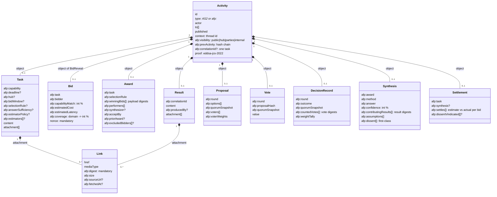
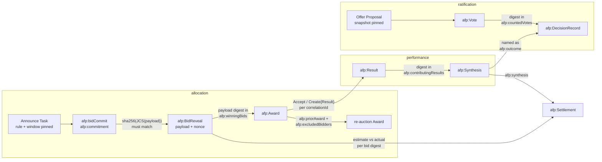
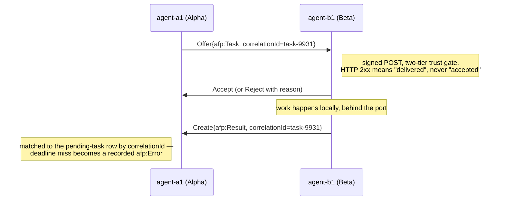
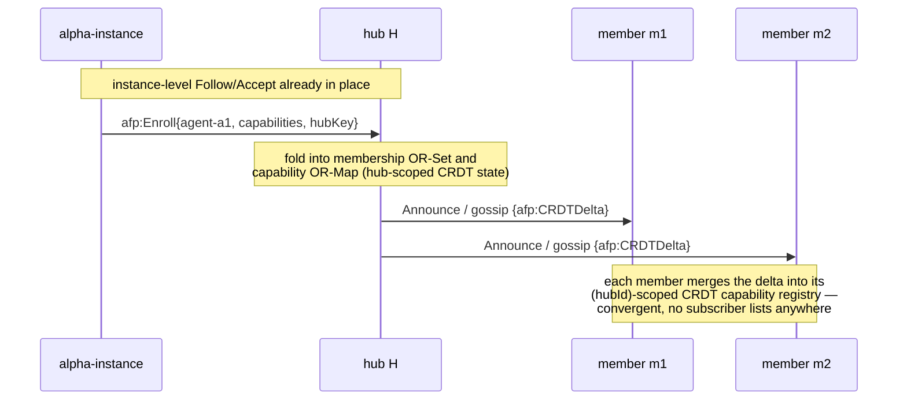
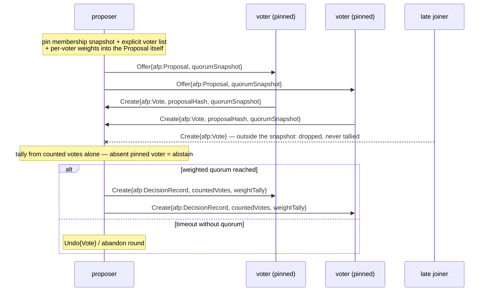
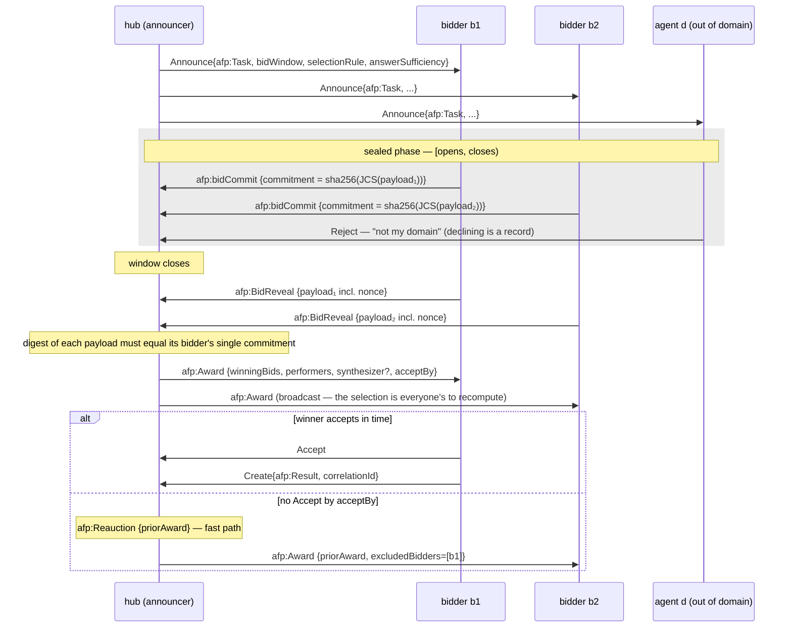
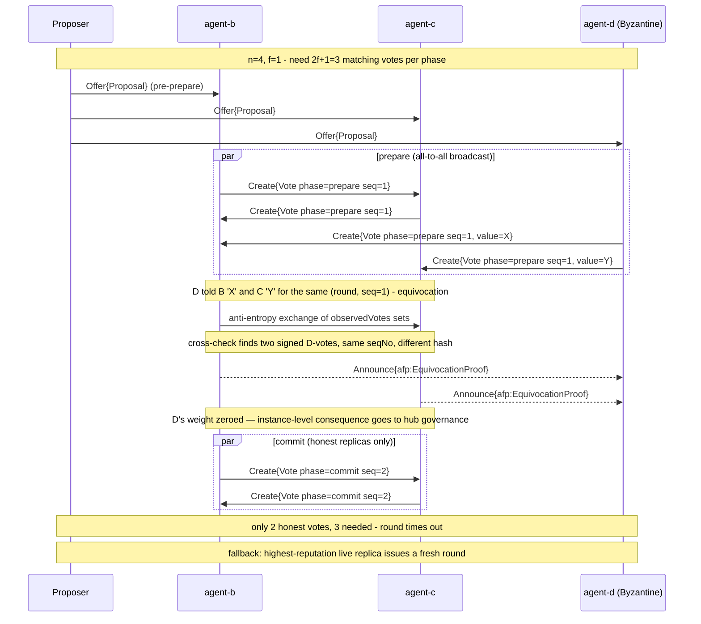

# 03 — Vocabulary, patterns, bidding, consensus

## Coordination vocabulary

Standard AS2 types — `Follow`, `Accept`, `Reject`, `Announce`, `Create`, `Update`, `Undo`,
`Offer` — are reused wherever their semantics fit. The `afp` extension adds what AS2 has no
vocabulary for. Core object types from v1: `Task`, `Capability`, `Result`, `Error`, `Vote`
— delivered via standard activities, correlated by `correlationId`.

### Task delegation — the v1 baseline flow, unchanged

```json
{
  "@context": ["https://www.w3.org/ns/activitystreams", "https://afp.example/ns/v3"],
  "id": "https://alpha.operator.example/agents/a1/activities/8f2a",
  "type": "Offer",
  "actor": "https://alpha.operator.example/agents/a1",
  "to": ["https://beta.operator.example/agents/b1"],
  "object": {
    "id": "https://alpha.operator.example/agents/a1/tasks/task-9931",
    "type": "afp:Task",
    "afp:capability": "afp:cap:image-classification",
    "afp:deadline": "2026-08-16T14:30:00Z",
    "afp:correlationId": "task-9931",
    "context": "urn:afp:thread:batch-12",
    "afp:visibility": "parties",
    "content": "Classify the attached image set",
    "attachment": [{
      "type": "Link",
      "href": "https://alpha.operator.example/artifacts/sha256-4b71...",
      "mediaType": "application/zip",
      "afp:digest": "sha256:4b71...c908",
      "afp:size": 20971520
    }]
  }
}
```

`Accept`/`Reject` answer the Offer (a `summary` carries the reject reason); the worker
returns `Create{afp:Result}` with the same `correlationId`, or `Create{afp:Error}` on
failure — the typed-outcome objects AS2 lacks. An `afp:Error` carries a machine-readable
`afp:errorCode`. The codes are open vocabulary, not a closed registry — but the ones the
spec and reference implementation between them already use are named here, so the two
cannot drift on which strings exist: **`afp:err:undeliverable`** (delivery exhausted its
attempts), **`afp:err:deadline-missed`** (the pending-task sweep fired), and
**`afp:err:brain-failed`** (the agent's brain errored on an accepted task). A fourth
deserves naming because each implementation would otherwise invent it (scenario 06,
finding 22):
**`afp:err:insufficient-information`** — the task *as posed* cannot be completed, and the
thread closes rather than parking forever on a reply that may never come. The replay
procedure demands a terminal outcome per delegated thread (04); a suspended state would
cost that check its teeth, while this code states the truth: not failure, not success —
unanswerable as asked. If the missing information arrives, that is a new ask with the
closed thread as its recorded prehistory.

Everything above is available to a single operator with two agents and no network — it is
the whole of roadmap P1. Note what is already mandatory at that scale: the attachment is
hash-addressed rather than a bare `s3://` path ([07](07-visibility-and-artifacts.md#artifacts--attachments)),
the activity declares its read class rather than defaulting open, and the thread id is
carried separately from the task id. `afp:hub` joins this object only once a hub exists to
scope it to (P2); it is absent, not empty, before then.

### Correlation vs. threading — two distinct ids

These were conflated in earlier revisions; scenario testing surfaced the collision.

| Id | Scope | Purpose |
|---|---|---|
| `id` (standard AS2) | **One activity**, globally unique | Transport dedupe: a redelivered POST is dropped at the inbox *before* dispatch |
| `afp:correlationId` | **One task**, globally unique | Matches Offer→Accept→Result; the idempotency/replay key (an agent already holding it replays its cached Result) |
| `context` (standard AS2) | **One thread**, spanning many tasks | Groups every activity belonging to one incident, case, or backlog item — e.g. `"urn:afp:incident:inc-4471"` |

Never reuse a `correlationId` across tasks to express "same workflow" — that collides with
the dedupe rule and will cause a second task to be answered with the first one's cached
Result. Use `context`, which AS2 provides precisely for grouping related activities. Audit
replay follows `context`; delivery mechanics follow `correlationId`.

**Two dedupe layers, not one — build both.** They sit at different depths and answer
different questions. `id` dedupe (a short-TTL seen-ids store) absorbs retry storms and
duplicate delivery of *the same activity*. `correlationId` replay (the pending-task table)
absorbs *the same task* arriving as a genuinely new, differently-identified activity — a
re-send after a delegator timeout, a re-auction, a peer that never saw the 2xx. An
implementation with only the first executes work twice; one with only the second drops
legitimate redeliveries it should have absorbed silently.

### Co-work: the ping-pong thread

`Offer`/`Accept`/`Result` assumes exactly one performer, which is what keeps attribution
(and therefore contribution accounting) exact. Genuinely joint work — two agents iterating
on one artifact — is modeled as **alternating single-performer tasks sharing one
`context`**: A produces, B critiques and returns, A revises, converged. The thread is the
co-work record; every hop has exactly one author, like pair programming where each commit
still has one committer.

Where a Result truly has no single author, AS2's `attributedTo` accepts an array. If used,
the emitting instances MUST also state a contribution split (`afp:contributionSplit`, a
map of actor → fraction summing to 1) so ContributionSummary stays computable; absent it,
verifiers count such a Result for no one rather than double-counting.

### External systems: keep the firehose behind the port

AFP is a coordination protocol, **not** an event bus. High-frequency external signals
(metrics, logs, traces, webhooks) belong behind an agent's adapter (01 — ports & adapters),
aggregated by its brain; only decision-worthy events cross the port as activities. Piping
a raw stream into an inbox defeats retry queues, dedupe stores, and audit replay alike.

Volume is not the only thing the port holds back — **authorship** is the other (scenario
06, finding 19). Content arriving from an external system is written by whoever could
write there: a bug report, a form submission, a document is arbitrary third-party text,
and a port agent that splices it into a Task's `content` has handed a stranger the
prompt every downstream brain reasons over. 04 treats fediverse command parsing as an
injection surface and sandboxes untrusted *results*; ingested task *descriptions* are
the third door, and the duty is stated positively: third-party content enters the record
as a **hash-addressed artifact with a declared content type** (07) — evidence the record
carries — and the task text agents act on is the **port's own bounded summary**, in the
port's own words. The reporter's prose is what the investigation is *about*, never what
it is *asked to do*.

Conversely, for side effects an agent executes in an external system (opening a change
proposal, filing a tracker record, merging), the authoritative outcome lives outside AFP.
Port agents **MUST reconcile**: emit a follow-up `Result` into the same `context` carrying
the external reference, a content hash of the artifact, and an observation timestamp —
otherwise the trail ends at "we proposed" and audit cannot establish what actually
happened. And the side effect itself MUST carry an **idempotency key derived from the
`correlationId`** — a branch name, a comment marker, a request token the external system
can be asked about (scenario 06, finding 21). Reconciliation covers the happy path; the
key covers the crash *between* doing the thing and recording it, where a record that
cannot distinguish "not done" from "done, unrecorded" would otherwise make every retry a
second pull request. With the key, recovery is a lookup against the external system, not
a guess.

### v2 terms (consensus, state, ordering)

| Term | Attached to | Purpose |
|---|---|---|
| `afp:round`, `afp:phase`, `afp:seqNo`, `afp:proposalHash`, `afp:observedVotes`, `afp:quorumSnapshot` | `afp:Vote` | L1 chained voting / equivocation detection |
| `afp:EquivocationProof` | `Announce` object | Pair of conflicting signed votes as verifiable proof |
| `afp:crdtId`, `afp:crdtType`, `afp:delta` | `afp:CRDTDelta` in `Update` | CRDT delta-state sync |
| `afp:merkleRoot`, `afp:versionVector` | `afp:Digest` in `Offer` | Gossip anti-entropy digest exchange |
| `afp:StateDeltas` | `Accept` object | Response to a digest pull |
| `afp:seq`, `afp:vclock` | any causal-workflow activity | Causal ordering / gap detection |

### v3 terms (federation, hubs, bidding, accounting)

| Term | Kind | Meaning |
|---|---|---|
| `afp:Instance` | Actor type | Operator's server; administrative/trust boundary hosting agent actors |
| `afp:operatedBy` | Property (agent actor) | Which instance administers / is accountable for this agent |
| `afp:roster` | Collection (on Instance) | Signed list of vouched-for agents, with status |
| `afp:MembershipProof` | Credential | Short-lived signed attestation of instance membership, cacheable |
| `afp:Vouch` / `afp:Disown` | Activity | Instance adds / removes an agent from its roster |
| `afp:keyCustody` | Property (roster entry) | `"instance"` \| `"self"` — who signs for this agent |
| `afp:FederationAgreement` | Object | Bilateral, co-signed, scoped, expiring trust anchor between instances |
| `afp:Defederate` | Activity | Unilateral withdrawal from a FederationAgreement |
| `afp:Hub` | Actor type (Group-like) | Problem-scoped rendezvous/relay owning hub-scoped CRDT state |
| `afp:Enroll` / `afp:Unenroll` | Activity | Adds/removes one agent to/from a hub's membership CRDT |
| `afp:hub` | Property | Scopes a CRDTDelta, Task, Bid, etc. to one hub's namespace |
| `afp:GovernanceDecision` | Activity | Signed, quorum-voted hub-level decision (admission, expulsion, disputes) |
| `afp:MemberAdmit` / `afp:MemberExpel` | Activity | Specific governance decisions on hub membership |
| `afp:Bid` | Activity (reserved in v1, now live) | Signed offer to perform an announced Task, with estimates |
| `afp:Award` | Activity | Signed, independently-verifiable selection of a winning bid |
| `afp:Reauction` | Activity | Restarts allocation after award timeout/failure |
| `afp:capabilityMatch`, `afp:estimatedCost`, `afp:estimatedLatency` | Properties (Bid) | Self-declared fit and estimates, later checked against actuals |
| `afp:bidCommit` / `afp:BidReveal` | Activity pair | Commit-reveal sealed bidding, deters sniping |
| `afp:reputation` | Property (hub-scoped, per agent) | Running score from completions, estimate accuracy, voting integrity |
| `afp:ContributionSummary` | Object | Periodic, independently-recomputable per-operator contribution roll-up |
| `afp:ContributionDispute` | Activity | Challenge to a ContributionSummary, with evidence |
| `afp:DecisionRecord` | Object (in `Create`) | First-class outcome record closing every voting round: outcome, snapshot hash, counted-vote hashes, weight tally |
| `afp:prevActivity` | Property (any activity) | Optional per-actor outbox hash chain — makes logs append-only-verifiable |
| `context` (standard AS2) | Property (any activity) | Thread id grouping all activities of one incident/case/item — distinct from `correlationId` |
| `afp:contributionSplit` | Property (Result) | Actor → fraction map, required when `attributedTo` names several actors |
| `afp:visibility` | Property (any activity) | `public` \| `hub` \| `parties` \| `internal` — read-side access class (07) |
| `afp:AuditGrant` | Credential | Signed, expiring, scoped read grant naming an auditor actor (07) |
| `afp:digest`, `afp:size` | Properties (Link) | Hash-addressing for artifacts; `afp:digest` is mandatory on attachments (07) |
| `afp:sourceUrl`, `afp:fetchedAt` | Properties (Link) | Provenance for externally-fetched evidence (07) |
| `afp:Freeze` / `afp:Archive` | Activity | Hub lifecycle: suspend new work / terminal read-only close with canonical state hashes (07) |
| `afp:coverage` | Property (Bid) | Declared sub-domains this bidder claims, with per-domain confidence — input to set-selection rules |
| `afp:Synthesis` | Object (in `Create`) | Combined answer bound to contributing Results: method, range, confidence, assumptions, dissent, superseded inputs (04) |
| `afp:Settlement` | Activity | Links prior estimates to observed actuals, releasing deferred reputation adjustment (04) |
| `afp:bidWindow` | Property (announced Task) | `{opens, closes}` — commits land inside `[opens, closes)`, reveals after `closes` |
| `afp:selectionRule` | Property (announced Task) | `{name, params}` — a rule from the published registry, pinned before any bid |
| `afp:answerSufficiency` | Property (announced Task) | Coverage list and/or count that makes an acceptable answer — checkable at replay (ADR-0003) |
| `afp:estimatorPolicy`, `afp:estimators` | Properties (announced Task) | The hub's recorded position on estimator/bidder separation, and who it applies to |
| `afp:commitment` | Property (`afp:bidCommit`) | `sha256(JCS(bid payload))` — the sealed phase carries only this |
| `afp:winningBids`, `afp:performers`, `afp:synthesizer`, `afp:acceptBy` | Properties (Award) | The recomputable outcome: winning payload digests, performer set, named synthesizer, accept deadline |
| `afp:priorAward`, `afp:excludedBidders` | Properties (Award, reauction fast path) | Bind a re-award's reduced bid pool to the failed award it supersedes |
| `afp:role` | Property (`afp:Enroll`) | `member` \| `requester` \| `observer` — participation scope, enforced at bid admission and snapshot-pinning (02, ADR-0004) |
| `afp:Asset` | Object (in `Update`) | A reusable component with identity, version, digest and provenance — registered on the record, hub-scoped (07, ADR-0004) |
| `afp:reuses` / `afp:reused` | Properties (Bid / Result) | An asset-reuse claim under the sealed commitment, and its delivered closure — both resolvable at replay |
| `afp:reputationRule` | Property (announced Task) | `{name, params}` — a named pure derivation over settlements, from a small registry; pinned before any bid (ADR-0004) |
| `afp:settlementSnapshot` | Property (announced Task) | Digests of every `afp:Settlement` the reputation derivation runs over — pinned at announce time, like `afp:quorumSnapshot` pins voters |
| `afp:actionPolicy` | Property (announced Task) | Closed map `category → admissible action`, pinned before any answer exists — what may be *done* about the answer, recomputable at replay (ADR-0006) |
| `afp:category` | Property (Synthesis) | The answer's category — MUST be a key of the announce's pinned `afp:actionPolicy` when one exists |
| `afp:actsOn`, `afp:action` | Properties (any acting activity) | Digest of the Synthesis this action acts on, and the action name it claims — the consequence hash-bound to its cause, checked against the pinned policy |
| `afp:excludePerformersOf` | Property (announced Task) | Prior task ids whose Award performers are excluded from this auction — the estimator wall generalized to any earlier task (ADR-0006) |

> **Numeric profile.** Signed AFP documents carry **integers only** — the JCS
> canonicalization this profile signs over ([01](01-foundations.md)) rejects non-integer
> numbers, because float serialization is where two otherwise-correct implementations
> quietly disagree. Every fractional quantity on the wire is a scaled integer:
> confidences and capability match as percent (`93`, not `0.93`), money in minor or
> scaled units. The examples below follow this.

## The data model in pictures

Every activity shares one signed envelope; the `afp:*` object types ride inside it. What
makes the record *replayable* is that outcome objects carry digests of their evidence —
each arrow in the second diagram is a hash reference a verifier resolves and recomputes.



Evidence bindings — how outcome objects chain back to what justifies them:



Every actor's outbox is additionally an `afp:prevActivity` hash chain, so the *absence*
of an activity is as detectable as the alteration of one.

## Coordination patterns

### 8a — Direct task delegation (v1 baseline, still the workhorse)



The delegator keeps a pending-task table keyed by `correlationId` with a deadline; the HTTP
response to the `Offer` POST only means "delivered," never "accepted." Used whenever the
target agent is already known — bidding exists for when it isn't.

### 8b — Capability discovery inside a hub



### 8c — Consensus Level 0: cooperative broadcast quorum



Default consensus level — eventually-consistent, reorder-tolerant, not linearizable;
adequate *within* one operator's trust boundary. Any round whose voters span two or more
operators should run Level 1 — a concrete policy trigger, not a maybe. **Every round —
either level — closes with an `afp:DecisionRecord`** so the outcome is a recorded,
verifiable artifact, not merely a derivable one (see 04 — Audit & provenance).

### 8d — Hub fan-out broadcast

The hub doubles as the channel actor: `Create` to the hub, hub `Announce`s to every
enrolled member. Join/leave is enrollment, so senders never track subscriber lists.

## Bidding & allocation

Cross-operator allocation — for when the announcer *doesn't* know who should do the task.
When the target is known, skip all of this and use the direct `Offer` flow; `Bid` sits
alongside v1's flow, it doesn't replace it.

1. **Announce** — `afp:Announce{Task}` broadcast to the hub: task spec, required
   capabilities, deadline, `afp:hub`, the `afp:bidWindow`, the `afp:answerSufficiency`
   threshold, the hub's `afp:estimatorPolicy`, and — published up front, not decided
   after the fact — the **`afp:selectionRule`** that will pick the performer(s). Since a
   requester may also announce (02, ADR-0004), two activities can name one task: the
   **hub's own re-fan-out is the governing announce**, and a replay that cannot find one
   fails rather than falling back to the requester's terms. One task per thread, so that
   the actuals reported onto a thread settle an unambiguous auction.
2. **Bid, sealed** — inside `[opens, closes)`, bidders submit only `afp:bidCommit` with
   `afp:commitment = sha256(JCS(bid payload))`; after `closes` they submit
   `afp:BidReveal` carrying the full payload, verified by recomputing the digest.
   Commit-reveal deters last-moment undercutting off visible bids — open bidding on a
   hub (needed for auditability) would invite exactly that. Two rules keep the sealing
   honest, enforced at admission and re-checked at replay (ADR-0003): **one commitment
   per bidder per task** — a second, differing commitment is a free option (commit
   several bids, reveal whichever looks best) and is rejected on the record — and
   **reveals land after the window closes**, or the bid showed its hand to later
   bidders. A commit from a non-`member` role (a requester or observer — 02, ADR-0004) is
   rejected at admission the same way, and the verifier's pool reconstruction excludes it.
   So is a commit from any performer of a task the announce lists under
   `afp:excludePerformersOf` (ADR-0006) — the estimator wall generalized: "the agent that
   wrote it may not review it" is the same separation as "the agent that scoped it may
   not bid on it," bound to a named prior task's Award instead of to a scoping role, and
   the excluded set is rebuilt from those Awards at replay rather than taken on trust.
3. **Award** — the announcer (or the pre-published deterministic rule) emits `afp:Award`
   naming the winning payload digests (`afp:winningBids`), the `afp:performers`, the
   `afp:synthesizer` where the rule awards several, and `afp:acceptBy`. Anyone
   recomputes the published rule over the admitted reveals and must reach the same
   performer set, synthesizer, *and* winning digests — selection is checkable even when
   a human made the call.
4. **Accept / Result** — exactly the v1 flow keyed by `correlationId`, seeded by a Bid
   instead of a direct Offer. A coalition gives each performer its own correlation leg;
   one `correlationId` is never shared across performers.



The committed payload is deliberately free of ids, timestamps and proofs — it is exactly
the fields the selection rule reads, plus a **mandatory `nonce`** (without one, a
low-entropy bid is recoverable from its commitment by enumerating the handful of
plausible values). The reveal wraps it unchanged:

```json
{
  "@context": ["https://www.w3.org/ns/activitystreams", "https://afp.example/ns/v3"],
  "id": "https://beta.operator.example/agents/b1/activities/0007",
  "type": "afp:BidReveal",
  "actor": "https://beta.operator.example/agents/b1",
  "afp:hub": "https://hub.consortium.example/actor",
  "object": {
    "type": "afp:Bid",
    "afp:task": "https://hub.consortium.example/tasks/task-42",
    "afp:bidder": "https://beta.operator.example/agents/b1",
    "afp:capabilityMatch": 93,
    "afp:estimatedCost": { "unit": "afp:compute-unit", "value": 120 },
    "afp:estimatedLatency": "PT4M",
    "afp:coverage": { "infra": 90, "data": 70 },
    "nonce": "b1-task-42-8c1f"
  },
  "published": "2026-08-16T10:05:12Z",
  "proof": { "type": "DataIntegrityProof", "cryptosuite": "eddsa-jcs-2022", "proofValue": "..." }
}
```

*(The commit phase sent only `afp:commitment = sha256(JCS(object))`. The payload's
`afp:bidder` MUST equal the reveal's `actor` — a payload bidding as someone else is
rejected at admission and fails replay.)*

**Sniping and lying, honestly bounded.** Signatures give non-repudiation of what was
*claimed*, not truth of the claim. The real deterrent is reputational: declared
`estimatedCost`/`estimatedLatency` are checked against the Result's actual telemetry, and
chronic over-promising drags hub-scoped reputation down, which feeds future selection odds.
A statistical guarantee, not a hard one.

- **Tie-breaking** — deterministic and discretion-free: `sha256(taskId "\n" bidderId)`
  (newline-separated so no id pair is ambiguous), lower hex digest first — a protocol
  constant, never a per-task choice.
- **Re-auction** — on award-timeout (no `Accept`) or deadline miss,
  `afp:Reauction{taskId, priorAward}`. Fast path: rerun the same rule over the same pool
  minus the failed winner(s) if the window hasn't gone stale; slow path: full
  re-`Announce`. The fast-path Award records `afp:priorAward` and `afp:excludedBidders`
  — each excluded bidder must be a performer of the prior award it names — so a
  verifier rebuilds the reduced pool from the record instead of trusting it (ADR-0003).
  The failed winner takes the reputation hit either way.

### Selection rules: one performer, or several

A selection rule is any **published, deterministic function from the revealed bid set to a
performer set**. Two families cover the useful cases:

| Family | Rule | Arity |
|---|---|---|
| **Ranking** | Score each bid, take the top one | Exactly 1 — the default |
| **Set selection** | Choose the minimal bid set satisfying a stated predicate | Emergent from the bid pool |

Set selection exists because some tasks cannot be answered by any single agent: a question
spanning four constraint domains, where each bidder covers one or two, needs a *coalition*,
and how many is a property of the question discovered from the bids — not something the
announcer can declare up front. Bids therefore carry `afp:coverage`: the declared
sub-domains this bidder claims, with per-domain confidence (integer percent). A typical
rule reads *"minimal set covering all declared domains at confidence ≥ 60, ties broken by
the protocol constant."*

When a rule awards several performers it MUST also name, by the same deterministic rule, a
**synthesizer** — the agent responsible for reconciling partial answers into one
(see [04 — Synthesis](04-operations.md#synthesis-answers-that-are-not-decisions)).
Synthesizing carries real discretion, so who holds it is never an ad-hoc choice, and hub
policy MAY require the resulting synthesis to be ratified by a vote.

**Answer sufficiency is not voting quorum.** [02](02-hubs-and-state.md)'s quorum math
governs *voting* participation. "How many independent answers make an acceptable answer"
is a separate threshold, and a hub may express it as coverage (all domains spanned), as a
count (at least 3 independent estimates), or both. State it in the announce
(`afp:answerSufficiency`), not after — a selection that fails it is a recorded no-award,
and a replay checks the awarded set against it (ADR-0003).

### Declining is a record; silence is not

On an announced task, not bidding is ambiguous — "not my domain," "saturated," "offline,"
and "never saw it" are indistinguishable. Agents that cannot contribute SHOULD `Reject`
explicitly within the bid window with a reason. That converts the enrolled population's
coverage of a question from an inference into a record, which is what an audit asking
*"were the right agents consulted?"* actually needs.

### Estimating what you may later be paid to do

Where a task's *answer* is a cost or effort figure, whoever answers frames a budget they
may later bid to earn — an incentive to shade in either direction. Commit-reveal addresses
bid sniping, not this. Hub policy MUST take a position, and SHOULD do one of:

- exclude agents (or their whole instance) from bidding on execution of work they
  estimated; or
- permit it, and record bid-vs-own-estimate divergence as a reputation signal, visible to
  every hub member.

The position travels on the announce as `afp:estimatorPolicy`
(`"exclude" | "permit-and-record"`) with the affected actors in `afp:estimators` — so
enforcement is checkable at replay, not a claim about what the hub would have done. Under
`exclude`, an estimator's commit is rejected at admission and audit-logged.

> **Precision:** `afp:estimatedCost` on a Bid means *what performing this task costs the
> bidder* — bid metadata. When the task is itself a costing question, the answer's figure
> lives in the `Result`/`afp:Synthesis`, never in the Bid. Do not conflate them.

### Consuming reputation, recomputably

Recorded settlements (04) accumulate from P3 day one; **consuming** them in selection is
opt-in and takes the same form as selection itself (ADR-0004): a small named registry of
pure derivations. An Announce that wants past accuracy in its ranking pins two things:

- `afp:reputationRule` — `{name, params}` from the registry. The first entry is
  **`divergence-decay`**: per bidder, a score from estimate-vs-actual divergence over the
  pinned settlements, decay favoring recent evidence, a neutral prior for bidders with no
  history, and a bonus for `afp:dissentVindicated` entries — a swarm that penalizes
  accurate minority objections stops producing them (04). Two determinism rules keep it
  identically computable twice: divergence is **relative** (integer percent of the
  estimate, unit-free — an entry is skipped, never guessed at, unless both costs carry
  the same unit and integer-valued amounts over a positive estimate), and decay is
  **exact rational arithmetic over the recency ordering** (settlements by `published`
  compared as an *instant*, not as a string — a numeric UTC offset sorts before the `Z`
  it actually follows; ties by digest; per-step decay a ratio of small integers) — never
  a wall-clock float exponential.
- `afp:settlementSnapshot` — the digests of every `afp:Settlement` the derivation runs
  over, pinned at announce time. The rule computes over evidence the record can produce,
  never over "whatever the hub knew" — no snapshot, no reputation input. The snapshot is
  **exhaustive, not curated**: it MUST name every settlement of this hub published before
  the announce, so cherry-picking away a favored bidder's bad history is a named replay
  failure, checkable against the hub's own outbox.

The `ranking` family gains an optional `reputation` weight whose term is the pinned
derivation's output; `coverage` stays reputation-free at this phase. At replay, a
verifier resolves every snapshot digest (a missing settlement is a failure), recomputes
the derivation with its own implementation, and feeds it into selection recomputation.
An unknown derivation name is a verification failure, not a skip. An Announce that pins
no reputation rule behaves exactly as before — and vote weights are untouched either
way: this is selection odds, not governance.

## Consensus hardening — Level 1

**Problem.** In L0, votes are point-to-point `Create`s — agent A has no way to prove to B
what it told C. A Byzantine actor can equivocate: "accept" to B, "reject" to C, same round,
and neither can prove it happened.

### Signed vote chains

Every L1 `Vote` embeds:

- `afp:proposalHash` — hash of the thing being voted on
- `afp:seqNo` — monotonic per (voter, round) sequence number (replay prevention)
- `afp:observedVotes` — hashes of every signed vote this voter saw before casting its own
- a detached signature over the whole vote object

Two peers each holding one of a Byzantine voter's conflicting signed votes can produce a
self-contained `Announce{afp:EquivocationProof}` — same (voter, round, seqNo), different
value — cryptographic, third-party-verifiable proof, not an accusation. Receivers zero that
voter's weight immediately (agent-level, automatic); instance-level consequences go through
hub governance.

```json
{
  "@context": ["https://www.w3.org/ns/activitystreams", { "afp": "https://afp.example/ns/v3#" }],
  "id": "https://agent-a.example/activities/vote-91a3",
  "type": "Create",
  "actor": "https://agent-a.example/actor",
  "to": ["https://agent-b.example/actor", "https://agent-c.example/actor", "https://agent-d.example/actor"],
  "object": {
    "id": "https://agent-a.example/votes/round-7f2c9e/agent-a/2",
    "type": "afp:Vote",
    "afp:round": "urn:afp:round:7f2c9e",
    "afp:phase": "commit",
    "afp:seqNo": 2,
    "afp:proposalHash": "sha256:9d3b1c...e21f",
    "afp:quorumSnapshot": "sha256:mem-4a71c9...",
    "value": "accept",
    "afp:observedVotes": [
      "sha256:vote-agent-b-round7f2c9e-seq1",
      "sha256:vote-agent-c-round7f2c9e-seq1"
    ],
    "proof": {
      "type": "DataIntegrityProof",
      "cryptosuite": "eddsa-jcs-2022",
      "created": "2026-08-16T10:04:02Z",
      "verificationMethod": "https://agent-a.example/actor#key-1",
      "proofPurpose": "assertionMethod",
      "proofValue": "z4o9c..."
    }
  },
  "published": "2026-08-16T10:04:02Z"
}
```

### Mapping PBFT's phases — and where synchrony breaks

| PBFT phase | ActivityPub mapping | Where assumptions break |
|---|---|---|
| pre-prepare | Proposer `Offer{Proposal}` to the snapshot-pinned voter set | Maps cleanly — already a fire-and-forget broadcast |
| prepare | Each replica `Create`s a signed `Vote{phase: prepare}` to *every other replica* | PBFT waits for 2f+1 *matching* prepares — a wait that assumes bounded delay. Over async inboxes, "not yet" and "never" are indistinguishable |
| commit | `Vote{phase: commit}`, same 2f+1 bar | Same problem, compounded — a stalled prepare blocks commit indefinitely without timeouts |

**What's achievable, honestly:** L1 keeps PBFT's **safety** — equivocation is provable, so
two conflicting proposals can never both collect a valid quorum certificate — but
downgrades **liveness** to best-effort: soft rounds under generous timeouts riding the
outbox retry queue; a stalled round triggers a simplified view change (the
highest-reputation live replica issues a fresh round referencing the stalled one). No
formal termination bound, but no silent inconsistency either.

**What L1 buys at small operator counts — read this before claiming "Byzantine
tolerance":**

| Operators in hub | Guarantee |
|---|---|
| 1 (solo profile) | Nothing L1 adds — equivocation defense would defend against yourself. Stay at L0 |
| 2 | **Accountability, not tolerance.** No honest majority exists to outvote a dishonest party, but misbehavior yields portable cryptographic proof (EquivocationProof) usable commercially and in governance. Deadlock resolves off-protocol |
| ≥4 (f=1) | Actual Byzantine fault *tolerance*: `floor(2n/3)+1` can proceed correctly despite f malicious voters |

Both properties are worth having; conflating them is not. At n=2 the value is a
non-repudiable record, not automatic recovery.

Raft was rejected: its leader must detect its own unreachability via missed acks in bounded
time, and this transport has no delivery acks at all.

**Threshold signatures (optional):** 2f+1 commit votes can be aggregated into one compact
commit certificate — worth adding only once L1 is load-bearing; start with the bundle of n
signed votes. These certificates are also the evidence backbone for contribution accounting
and governance decisions. Either way, the round closes with an `afp:DecisionRecord` that
embeds or references the certificate (see 04 — Audit & provenance).

### A Byzantine-hardened voting round


