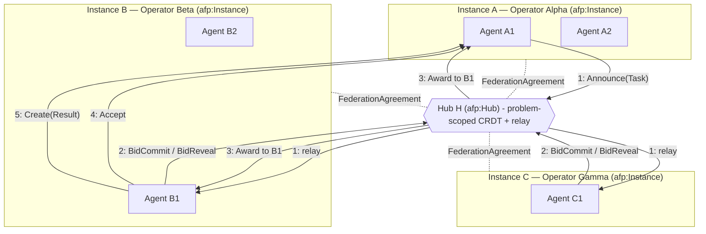
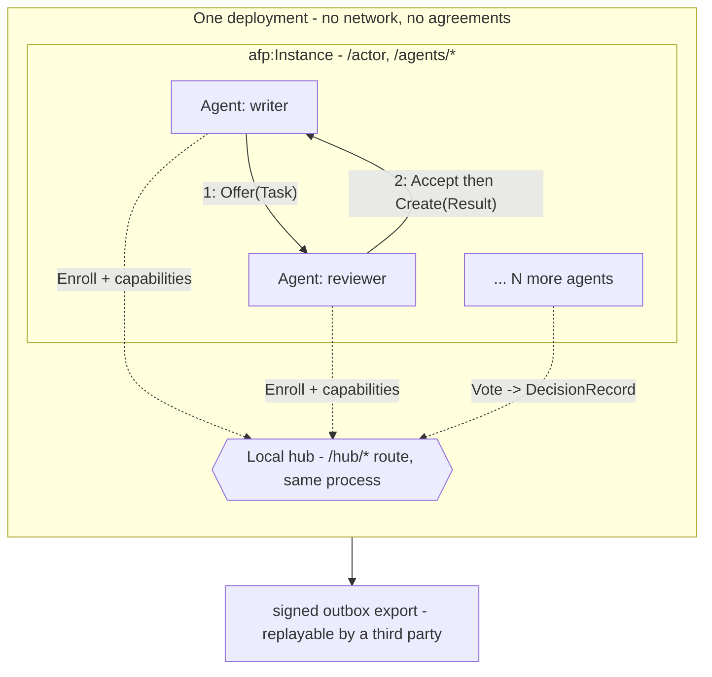
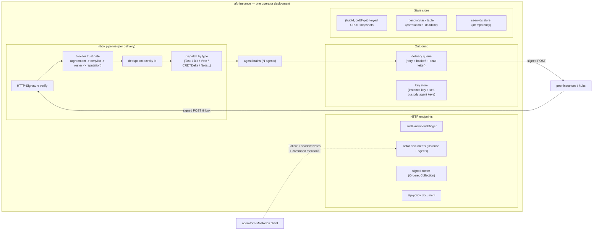

# Agent Federation Protocol (AFP) — v3.20

Multiple operators, each running their own instance of agents, join forces on a common
problem — federating through problem-scoped hubs over **ActivityPub** (the W3C protocol
behind Mastodon). No central broker, consortium trust, no token economics.

This is the markdown rendition of the full spec (Revision 3.20). Reading order:

| File | Contents |
|---|---|
| [01-foundations.md](01-foundations.md) | Agents as actors · the operator instance · the agent–instance boundary (ports & adapters) · two-tier trust · discovery & identity |
| [02-hubs-and-state.md](02-hubs-and-state.md) | Problem-scoped hubs · CRDT shared state · gossip/anti-entropy · membership & quorum · causal ordering |
| [03-coordination.md](03-coordination.md) | Vocabulary (`afp:*`) · correlation vs. threading · co-work · external-system ports · coordination patterns · bidding, selection rules & coalitions · Byzantine consensus (L1) |
| [04-operations.md](04-operations.md) | Contribution accounting · **audit & provenance** (DecisionRecord, hash-chained outboxes, Synthesis, Settlement, the replay procedure) · reliability · security · Mastodon interop |
| [05-roadmap.md](05-roadmap.md) | Phased roadmap P1–P7 · the P1 acceptance gate · profiles · open questions |
| [06-deployment-profiles.md](06-deployment-profiles.md) | Solo/airgapped vs. federated profiles · the "consortium of one" · sneakernet federation |
| [07-visibility-and-artifacts.md](07-visibility-and-artifacts.md) | Audience & visibility classes · authorized fetch · auditor grants · hash-addressed artifacts · hub lifecycle |
| [scenarios/](scenarios/) | Spec-test scenarios — each walks a real workload end to end and ends with a verdict of what held and what strained |
| [adr/](adr/) | Architecture decision records — [ADR-0001](adr/0001-p1-stack.md): the P1 technology stack · [ADR-0002](adr/0002-p2-hub-and-crdt-stack.md): the P2 hub & CRDT stack · [ADR-0003](adr/0003-p3-allocation-stack.md): the P3 allocation stack · [ADR-0004](adr/0004-solo-foundation-hardening.md) (built): solo-foundation hardening before federation · [ADR-0005](adr/0005-operators-are-equal.md) (accepted): operators are equal against a hub · [ADR-0006](adr/0006-checkable-actuation.md) (built): checkable actuation · [ADR-0007](adr/0007-supersession.md) (built): supersession · [ADR-0008](adr/0008-p4-federation-stack.md) (built): the P4 federation stack · [ADR-0009](adr/0009-federated-replay.md) (built): federated replay & lawful redaction · [ADR-0010](adr/0010-pinning-without-an-auction.md) (built): pinning without an auction · [ADR-0011](adr/0011-supersession-meets-the-irreversible-world.md) (built): supersession meets the irreversible world · [ADR-0012](adr/0012-the-long-horizon.md) (built): the long horizon |

## Where to start building

**[P1](05-roadmap.md#p1--one-instance-two-agents-one-verifiable-record) — one instance, two
agents, one verifiable record.** A writer and a reviewer in a single process, no network:
draft, critique, revision. The deliverable is not the finished document — it is an exported
record that a stranger holding no keys can replay and verify, and that fails loudly when a
single byte of evidence is altered or a single activity is removed.

That demo is deliberately tiny and deliberately load-bearing. Signing, hash-chained
outboxes, visibility classes and hash-addressed evidence are all **P1 obligations**, not a
later audit phase — they are nearly free at two agents and impossible to backfill at two
hundred. Every phase after P1 adds participants, never integrity machinery.

The stack is decided in [ADR-0001](adr/0001-p1-stack.md) and **built**: TypeScript on Node,
SQLite, `eddsa-jcs-2022` object integrity proofs, and a replay verifier that is a
deliberately independent second implementation in another language — because a verifier
sharing code with the writer would only be attesting to its own bugs.

**[P2](05-roadmap.md#p2p7) — local hub & L0 deliberation — is built too**
([ADR-0002](adr/0002-p2-hub-and-crdt-stack.md)): an `afp:Hub` beside the agents, two-level
enrollment, hub-scoped CRDT state with version vectors, and weighted-quorum rounds closing
with a signed `afp:DecisionRecord` the verifier recomputes from the record alone.

**[P3](05-roadmap.md#p2p7) — local allocation — is built**
([ADR-0003](adr/0003-p3-allocation-stack.md)): sealed commit-reveal bidding, a registry of
pure selection rules (ranking and coverage set-selection with a deterministically named
synthesizer), a recomputable `afp:Award`, `afp:Reauction` on timeout, `afp:Synthesis` with
first-class dissent ratified by an L0 round, `afp:Settlement`, and the estimator/bidder
wall enforced at bid admission. Both rule families are independently reimplemented in the
verifier, which rebuilds the admitted bid pool from the record alone. The same auction
also runs with real model-written answers (`npm run demo:p3:llm`) — the record's shape,
and the verifier's verdict, are identical either way. That completes the **solo profile**
(P1→P3) — since **hardened before federation** by four further ADRs, each built and gated:
roles, assets and recomputable reputation ([ADR-0004](adr/0004-solo-foundation-hardening.md)),
per-operator vote weight ([ADR-0005](adr/0005-operators-are-equal.md)), checkable actuation
([ADR-0006](adr/0006-checkable-actuation.md)), and supersession
([ADR-0007](adr/0007-supersession.md)) — and since extended where campaign 6 found the
solo profile losing its checks: pins on the direct `Offer`
([ADR-0010](adr/0010-pinning-without-an-auction.md)) and the irreversible world
([ADR-0011](adr/0011-supersession-meets-the-irreversible-world.md)). **P4 is built too**
([ADR-0008](adr/0008-p4-federation-stack.md)), with federated replay and lawful redaction
over it ([ADR-0009](adr/0009-federated-replay.md)).

| | |
|---|---|
| [`src/instance/`](../../src/instance/) | The instance — no dependencies, no build step. `npm run demo`, `demo:p2`, `demo:p3`, `npm run gate`. Brains run on any OpenAI-compatible endpoint (a local Qwen by default) |
| [`src/verifier/`](../../src/verifier/) | `afp_verify.py` — replays an export with no access to the instance |

All [acceptance-gate](05-roadmap.md#acceptance-gate) checks pass across the built phases,
including deliberate mutations at every gate — the original ten across P1–P3 (flipped
evidence byte, removed activity, re-signed tail, deleted outbox; DecisionRecord attacks;
deleted winning reveal, swapped performer set, mismatched winning-bid evidence), and the
hardening gates' beyond them (ADR-0004–0007), which break roles, asset immutability,
reputation snapshots, voter weights, action policies and supersession one named check at
a time — each failing the replay with a specific pointer.

## The multi-operator model

The Fediverse topology transplanted onto agent coordination:

| Fediverse | AFP |
|---|---|
| Mastodon instance (one server, many user actors) | `afp:Instance` — one operator's server, many agent actors |
| Federation between instances | Instance peering via co-signed `afp:FederationAgreement` |
| Relay / community (Lemmy-style Group) | `afp:Hub` — problem-scoped rendezvous, relay, shared state |
| Server moderation / defederation | Two-tier trust: instance gates + per-agent, per-hub reputation |

**Trust model:** a *consortium* — operators who have agreed to collaborate, admitted
explicitly (deny by default). Not an open permissionless market. No token or crypto
economics anywhere in the design; contribution accounting only.

## Topology

### Federated: three operators, one problem hub

Dotted edges = trust boundary (`FederationAgreement`s, established once, out of band from
any task). Solid numbered edges = the message path of one competitively-allocated task.

Note steps 4–5: once awarded, the actual work exchange is **direct** instance-to-instance —
the hub brokered discovery and allocation but sits on neither the task payload path nor the
result path. Hub downtime stalls new allocation, never in-flight work.

### Solo: the same topology, collapsed

One operator, one deployment, no network — the hub is a route in the same process, not a
second system. This is the first three phases (P1–P3) and, for many operators, the whole
deployment. Nothing here is a reduced dialect: joining a consortium later means signing an
agreement and enrolling in a remote hub *alongside* the local one, with no agent-code
changes.

Steps 1–2 alone are **P1**; the local hub, enrollment and L0 deliberation are **P2**; local
announce/bid/award over the same hub is **P3**. See
[06-deployment-profiles.md](06-deployment-profiles.md).

## Anatomy of an operator instance

What one `afp:Instance` deployment actually contains. The ActivityPub layer is a thin shim;
agent "brains" (LLM calls, business logic) sit behind it and never face the network directly.

## Revision history

| Rev | Focus |
|---|---|
| v1 | Baseline: agents as ActivityPub actors, `Offer{Task}` → `Accept` → `Create{Result}`, HTTP Signatures, WebFinger, retry/dedupe |
| v2 | Consensus & state hardening (mined from `.claude/agents/consensus/*.md`): L0/L1 layered consensus, equivocation proofs, CRDT state, gossip anti-entropy, dynamic weighted quorum, causal ordering |
| v3 | Multi-operator federation: `afp:Instance` as first-class trust boundary, bilateral `FederationAgreement`s, problem-scoped `afp:Hub`s, `afp:Bid` activated (commit-reveal), contribution accounting, Mastodon interop |
| v3.2–3.3 | The agent–instance boundary as ports & adapters (two boundaries, `afp:keyCustody` as the wiring knob); audit & provenance: `afp:DecisionRecord`, hash-chained outboxes, rationale externalization |
| v3.4 | Nine findings from the first scenario-test campaign: visibility classes & authorized fetch, hash-addressed artifacts, hub lifecycle, `correlationId`/`context` split, co-work threads, external-system reconciliation, honest L1 guarantees at small n |
| v3.5 | Six findings from scenario 04: coalition allocation (`afp:coverage`, set-selection rules, named synthesizer), `afp:Synthesis`, `afp:Settlement`, estimator separation of duties, explicit declines |
| v3.6 | Roadmap resequenced P1–P7 so every profile is a *prefix* (solo = P1→P3, no cherry-picking); P1 redesigned around a third-party-verifiable record with an 11-point acceptance gate; the four retrofit-hostile obligations pulled into P1; L0 deliberation and `DecisionRecord` given a phase |
| v3.7 | P1 stack decided ([ADR-0001](adr/0001-p1-stack.md)) and the spec changes it forced: signature suite moved to `DataIntegrityProof`/`eddsa-jcs-2022` (FEP-8b32), authentication restated as two mechanisms with different lifetimes, P1's crypto obligation corrected from HTTP Signatures to object integrity proofs |
| v3.8 | P1–P3 built and the spec changes implementation + review forced: the integer-only JCS numeric profile stated (03), commit-reveal hardened (mandatory `nonce`, one commitment per bidder, reveals after close, payload names its signer), the announce's pinned fields named (`afp:bidWindow`, `afp:selectionRule`, `afp:answerSufficiency`, `afp:estimatorPolicy`), reauction pools bound to the prior award, the tie-break constant made ambiguity-free; data-model and pattern diagrams in 03; scenario 05 (domain intelligence as an internal service) opens campaign 3: `afp:Asset` identity, requester/observer roles, the reputation-consumption trigger |
| v3.9 | Campaign 3 landed as the **solo-foundation hardening** before federation ([ADR-0004](adr/0004-solo-foundation-hardening.md)): `afp:role` on the Enroll (`member`/`requester`/`observer`, enforced at bid admission and snapshot-pinning); `afp:Asset` identity for reusable components with `afp:reuses`/`afp:reused` claims resolvable at replay (07); reputation consumption via a named derivation registry — `afp:reputationRule` + `afp:settlementSnapshot` pinned in the Announce, `divergence-decay` first (03) — keeping the Award a pure function of the record; the port-boundary confidentiality residue stated in 06 |
| v3.10 | ADR-0004 built, and the precision the build forced: `published` is ordered as an *instant*, never as a string, wherever ordering decides recorded state (role LWW in 02, settlement recency in 03) — a numeric UTC offset sorts before the `Z` it follows; `divergence-decay`'s usability rule stated as same-unit, integer-valued amounts over a positive estimate (03); the hub's own re-fan-out named as the governing announce now that requesters announce too, one task per thread (03); settlement's preconditions — follows an award, once per task — made explicit now that a reputation snapshot consumes it (04) |

| v3.11 | **Operators are equal against a hub** ([ADR-0005](adr/0005-operators-are-equal.md)): vote weight is per seated *instance*, not per agent — each instance carries the same total, divided among its live pinned voters as integers via a common denominator, so an operator's say no longer grows by running more agents (02). At one instance the rule reduces to today's uniform weight, so every existing export recomputes unchanged. Weights become recomputable from the pinned voters and the roster rather than merely recorded; quorum's `n` is seated instances, which is also the right unit for the Byzantine bound. Vote-weight reputation stays deferred, now with a stated reason: estimate accuracy is not judgement, and weighting governance by standing entrenches |

| v3.12 | Campaign 4's two lead findings landed as **checkable actuation** ([ADR-0006](adr/0006-checkable-actuation.md)): `afp:actionPolicy` — a closed `category → admissible action` map pinned in the Announce, `afp:category` on the Synthesis, and `afp:actsOn`/`afp:action` hash-binding every consequence to the answer that justified it, so replay can ask of any action whether it was what the answer permitted (03, 04); and `afp:excludePerformersOf` — the estimator wall generalized to any named prior task's performers, enforced at admission and rebuilt from prior Awards at replay, giving author/reviewer separation for one announce field (03) |

| v3.13 | Campaign 4's two precision findings: external side effects MUST carry an idempotency key derived from the `correlationId`, so a crash between acting and recording recovers by lookup rather than by a second pull request (03, 04); and `afp:err:insufficient-information` named as the honest terminal outcome for a task unanswerable as posed — the thread closes, and a later reply is a new ask with the closed thread as prehistory (03) |

| v3.14 | Campaign 4 closed. Finding 19: the port's ingestion duty stated positively — third-party content enters as hash-addressed evidence with a declared content type, and the task text agents act on is the port's own bounded summary; the reporter's prose is what the investigation is *about*, never what it is asked to do (03). Finding 24, via scenario 07 and [ADR-0007](adr/0007-supersession.md): `afp:supersedes` for answer-level retraction (distinct from input-level `supersededInputs`), ratification parity — a quorum's answer is retracted only by a quorum — and `afp:disposes`, so every action whose justification was withdrawn is visibly dealt with (04) |

| v3.15 | The **pairwise profile** named (06): federation without a hub — P1→P4, recognition and direct delegation, then stop. Coherent because the hub was never a trust anchor (02: no unilateral power beyond availability), so everything replay-guaranteed survives its absence; what it gives up is listed in cost order — the electorate first, then discovery, commons reputation, O(n) coordination, the canonical case file. Its boundary in one sentence: a hub is what you call the place where an electorate keeps its membership |

| v3.16 | **P4 built** ([ADR-0008](adr/0008-p4-federation-stack.md)): the federation handshake as dual-Create over a byte-identical grants-bearing agreement (one Create is an offer, not a permission); the two-tier gate live at a real HTTP inbox — the first resident process — with draft-cavage hop signatures over the one `eddsa-jcs-2022` payload suite; the hash-chained boundary log; expiry stalling new work never in-flight work, backstopped by chain-wide `published` monotonicity in the verifier; both ingestion duties enforced at the receiving port; shadow Notes, the command grammar and `afp:AuditGrant` (P4b). Gated by the first two-instance test over real localhost HTTP — Mallory hard-rejected and logged, 404-not-403, the post-expiry Offer refused while the in-flight Result lands. 01/04/05 amended; the LD-Signatures wording retired (findings 25–28, 30) |

| v3.17 | **Federated replay built** ([ADR-0009](adr/0009-federated-replay.md)), closing campaign 5: the verifier takes several exports and runs N single-domain replays plus a cross-check — domain-labelled findings, the co-signed agreement digest-equal in every party's bundle, received bytes matched against the sender's own record with divergence surfaced and absence attributed. Redaction is an export-time transform: digest-only `afp:Redacted` stubs keep chains linkable, `afp:exportScope` declares omissions, and the line 29b asked for is drawn — discretion is declared, deletion is detected. The boundary also learned custody: an instance-signed activity crossing with `afp:actingAs` verifies against the operator's published keys, P1's model carried across the wire |

| v3.18 | **Pinning without an auction built** ([ADR-0010](adr/0010-pinning-without-an-auction.md)), opening campaign 6: the checks campaigns 2–5 anchored to the Announce/Award pair now reach the direct flow the spec prescribes whenever the target is known. `afp:actionPolicy`, `afp:answerSufficiency` and the new `afp:synthesizer` ride on the `afp:Task` object of whichever activity opens the thread, and a thread's task activities MUST agree on the whole pinned set — an unpinned Offer added to a pinned thread is divergence, not abstention, or the policy is escapable by publishing one more. Replay gains a second root, not a second meaning: no `afp:award`, resolve the pins from the thread. `afp:actsOn` MAY name a `DecisionRecord`, followed one hop, so a deployment that ratifies binds to the artifact it ratified. And every policy declares a reserved `afp:no-verdict` action with its missing legs in `afp:absentInputs`, so "the panel could not screen" is a verdict with a consequence rather than an application parked forever (findings 34, 35, 37) |

| v3.19 | **Supersession meets the irreversible world built** ([ADR-0011](adr/0011-supersession-meets-the-irreversible-world.md)): ADR-0007 closed the actuation loop with a sentence assuming the world would accept the disposition and that the current quorum was a successor — scenario 09 broke both. Irreversibility is declared at pin time as `afp:irrevocableActions`, a sibling list rather than a flag inside the policy map, so ADR-0006's literal `category -> action` table survives intact; the `annotate` disposition then satisfies ADR-0007's existence check while commanding nothing, its admissibility check swapped for the declaration rather than waived. A superseding ratification carries `afp:priorQuorumSnapshot`, making a changed panel visible rather than implied, and settling who may answer after the panel moves: the pinned synthesizer binds unless the superseding answer is ratified. `afp:priorThread` gives 03's "recorded prehistory" a followable edge, tolerant of a lawfully scoped export that omits it (findings 38, 39) |

| v3.20 | **The long horizon built** ([ADR-0012](adr/0012-the-long-horizon.md)), closing campaign 6: an export now outlives the key that signed it. The manifest becomes a signed document carrying `afp:keyHistory` — every key that signed anything in the bundle, with its interval and whether it left service by rotation or revocation — and a signature resolves against the key valid *at its `published` instant*, so a routine rotation stops silently stranding the corpus signed before it. Rotation archives and revocation cuts; 01 said to treat a rotated key as revoked, which was the bug. `afp:members` enumerates what a bundle contains, checked both ways, and CRDT state is stated to be outside it — anything that must ever be disclosed, redacted or replayed has to live in activities. Retention duties are declared rather than guessed (`afp:retentionDuty`), and declaring one turns on the anchoring and byte-retention MUSTs; anchors are checked for coherence and never dereferenced, because the verifier reaches no network by design (finding 40, and the sharp half of 32) |

All `afp:` terms are this design's own `@context` extension over W3C ActivityStreams 2.0 —
not part of the standard.
