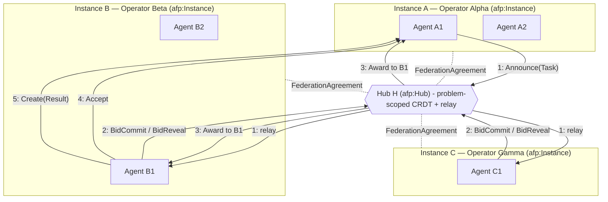
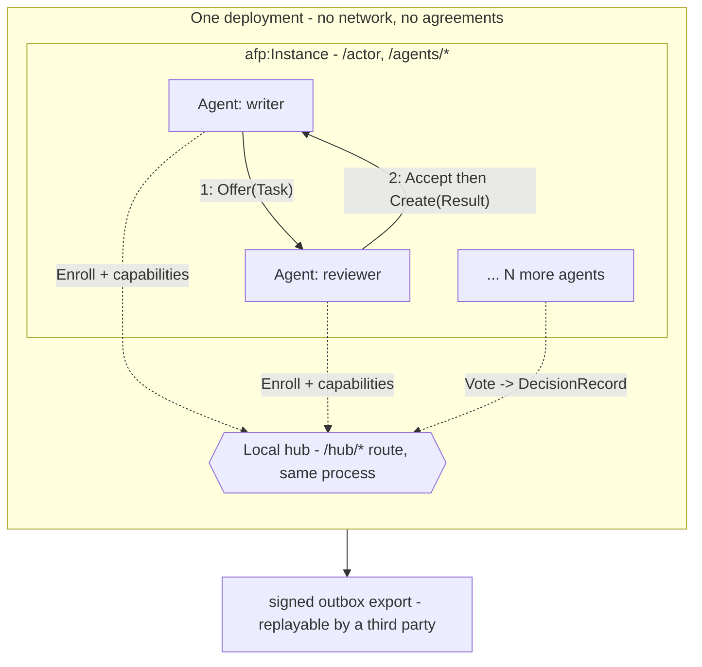
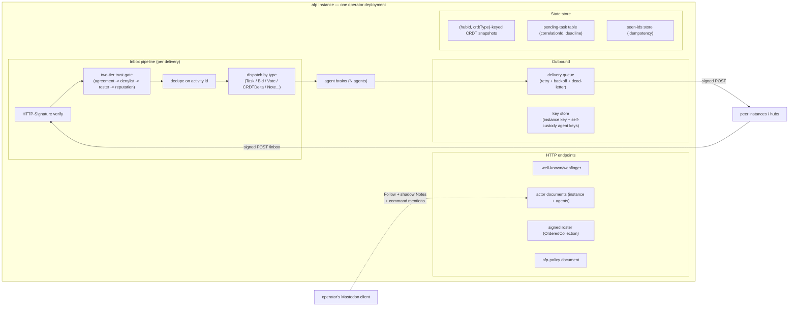

# Agent Federation Protocol (AFP) — v3.9

Multiple operators, each running their own instance of agents, join forces on a common
problem — federating through problem-scoped hubs over **ActivityPub** (the W3C protocol
behind Mastodon). No central broker, consortium trust, no token economics.

This is the markdown rendition of the full spec (Revision 3.9). Reading order:

| File | Contents |
|---|---|
| [01-foundations.md](01-foundations.md) | Agents as actors · the operator instance · the agent–instance boundary (ports & adapters) · two-tier trust · discovery & identity |
| [02-hubs-and-state.md](02-hubs-and-state.md) | Problem-scoped hubs · CRDT shared state · gossip/anti-entropy · membership & quorum · causal ordering |
| [03-coordination.md](03-coordination.md) | Vocabulary (`afp:*`) · correlation vs. threading · co-work · external-system ports · coordination patterns · bidding, selection rules & coalitions · Byzantine consensus (L1) |
| [04-operations.md](04-operations.md) | Contribution accounting · **audit & provenance** (DecisionRecord, hash-chained outboxes, Synthesis, Settlement, the replay procedure) · reliability · security · Mastodon interop |
| [05-roadmap.md](05-roadmap.md) | Phased roadmap P1–P7 · the P1 acceptance gate · profiles · open questions |
| [06-deployment-profiles.md](06-deployment-profiles.md) | Solo/airgapped vs. federated profiles · the "consortium of one" · sneakernet federation |
| [07-visibility-and-artifacts.md](07-visibility-and-artifacts.md) | Audience & visibility classes · authorized fetch · auditor grants · hash-addressed artifacts · hub lifecycle |
| [scenarios/](scenarios/) | Spec-test scenarios — each walks a real workload end to end and ends with a verdict of what held and what strained |
| [adr/](adr/) | Architecture decision records — [ADR-0001](adr/0001-p1-stack.md): the P1 technology stack · [ADR-0002](adr/0002-p2-hub-and-crdt-stack.md): the P2 hub & CRDT stack · [ADR-0003](adr/0003-p3-allocation-stack.md): the P3 allocation stack · [ADR-0004](adr/0004-solo-foundation-hardening.md) (proposed): solo-foundation hardening before federation |

## Where to start building

**[P1](05-roadmap.md#p1--one-instance-two-agents-one-verifiable-record) — one instance, two
agents, one verifiable record.** A writer and a reviewer in a single process, no network:
draft, critique, revision. The deliverable is not the finished document — it is an exported
record that a stranger holding no keys can replay and verify, and that fails loudly when a
single byte of evidence is altered or a single activity is removed.

That demo is deliberately tiny and deliberately load-bearing. Signing, hash-chained
outboxes, visibility classes and hash-addressed evidence are all **P1 obligations**, not a
later audit phase — they are nearly free at two agents and impossible to backfill at two
hundred. Every phase after P1 adds participants, never integrity machinery.

The stack is decided in [ADR-0001](adr/0001-p1-stack.md) and **built**: TypeScript on Node,
SQLite, `eddsa-jcs-2022` object integrity proofs, and a replay verifier that is a
deliberately independent second implementation in another language — because a verifier
sharing code with the writer would only be attesting to its own bugs.

**[P2](05-roadmap.md#p2p7) — local hub & L0 deliberation — is built too**
([ADR-0002](adr/0002-p2-hub-and-crdt-stack.md)): an `afp:Hub` beside the agents, two-level
enrollment, hub-scoped CRDT state with version vectors, and weighted-quorum rounds closing
with a signed `afp:DecisionRecord` the verifier recomputes from the record alone.

**[P3](05-roadmap.md#p2p7) — local allocation — is built**
([ADR-0003](adr/0003-p3-allocation-stack.md)): sealed commit-reveal bidding, a registry of
pure selection rules (ranking and coverage set-selection with a deterministically named
synthesizer), a recomputable `afp:Award`, `afp:Reauction` on timeout, `afp:Synthesis` with
first-class dissent ratified by an L0 round, `afp:Settlement`, and the estimator/bidder
wall enforced at bid admission. Both rule families are independently reimplemented in the
verifier, which rebuilds the admitted bid pool from the record alone. The same auction
also runs with real model-written answers (`npm run demo:p3:llm`) — the record's shape,
and the verifier's verdict, are identical either way. That completes the **solo profile**
(P1→P3); the next phase is P4's federation handshake.

| | |
|---|---|
| [`src/instance/`](../../src/instance/) | The instance — no dependencies, no build step. `npm run demo`, `demo:p2`, `demo:p3`, `npm run gate`. Brains run on any OpenAI-compatible endpoint (a local Qwen by default) |
| [`src/verifier/`](../../src/verifier/) | `afp_verify.py` — replays an export with no access to the instance |

All [acceptance-gate](05-roadmap.md#acceptance-gate) checks pass across the three built
phases, including the ten deliberate mutations — four P1 (flipped evidence byte, removed
activity, re-signed tail, deleted outbox), three P2 (DecisionRecord attacks), three P3
(deleted winning reveal, swapped performer set, mismatched winning-bid evidence) — each
failing the replay with a specific pointer.

## The multi-operator model

The Fediverse topology transplanted onto agent coordination:

| Fediverse | AFP |
|---|---|
| Mastodon instance (one server, many user actors) | `afp:Instance` — one operator's server, many agent actors |
| Federation between instances | Instance peering via co-signed `afp:FederationAgreement` |
| Relay / community (Lemmy-style Group) | `afp:Hub` — problem-scoped rendezvous, relay, shared state |
| Server moderation / defederation | Two-tier trust: instance gates + per-agent, per-hub reputation |

**Trust model:** a *consortium* — operators who have agreed to collaborate, admitted
explicitly (deny by default). Not an open permissionless market. No token or crypto
economics anywhere in the design; contribution accounting only.

## Topology

### Federated: three operators, one problem hub

Dotted edges = trust boundary (`FederationAgreement`s, established once, out of band from
any task). Solid numbered edges = the message path of one competitively-allocated task.

Note steps 4–5: once awarded, the actual work exchange is **direct** instance-to-instance —
the hub brokered discovery and allocation but sits on neither the task payload path nor the
result path. Hub downtime stalls new allocation, never in-flight work.

### Solo: the same topology, collapsed

One operator, one deployment, no network — the hub is a route in the same process, not a
second system. This is the first three phases (P1–P3) and, for many operators, the whole
deployment. Nothing here is a reduced dialect: joining a consortium later means signing an
agreement and enrolling in a remote hub *alongside* the local one, with no agent-code
changes.

Steps 1–2 alone are **P1**; the local hub, enrollment and L0 deliberation are **P2**; local
announce/bid/award over the same hub is **P3**. See
[06-deployment-profiles.md](06-deployment-profiles.md).

## Anatomy of an operator instance

What one `afp:Instance` deployment actually contains. The ActivityPub layer is a thin shim;
agent "brains" (LLM calls, business logic) sit behind it and never face the network directly.

## Revision history

| Rev | Focus |
|---|---|
| v1 | Baseline: agents as ActivityPub actors, `Offer{Task}` → `Accept` → `Create{Result}`, HTTP Signatures, WebFinger, retry/dedupe |
| v2 | Consensus & state hardening (mined from `.claude/agents/consensus/*.md`): L0/L1 layered consensus, equivocation proofs, CRDT state, gossip anti-entropy, dynamic weighted quorum, causal ordering |
| v3 | Multi-operator federation: `afp:Instance` as first-class trust boundary, bilateral `FederationAgreement`s, problem-scoped `afp:Hub`s, `afp:Bid` activated (commit-reveal), contribution accounting, Mastodon interop |
| v3.2–3.3 | The agent–instance boundary as ports & adapters (two boundaries, `afp:keyCustody` as the wiring knob); audit & provenance: `afp:DecisionRecord`, hash-chained outboxes, rationale externalization |
| v3.4 | Nine findings from the first scenario-test campaign: visibility classes & authorized fetch, hash-addressed artifacts, hub lifecycle, `correlationId`/`context` split, co-work threads, external-system reconciliation, honest L1 guarantees at small n |
| v3.5 | Six findings from scenario 04: coalition allocation (`afp:coverage`, set-selection rules, named synthesizer), `afp:Synthesis`, `afp:Settlement`, estimator separation of duties, explicit declines |
| v3.6 | Roadmap resequenced P1–P7 so every profile is a *prefix* (solo = P1→P3, no cherry-picking); P1 redesigned around a third-party-verifiable record with an 11-point acceptance gate; the four retrofit-hostile obligations pulled into P1; L0 deliberation and `DecisionRecord` given a phase |
| v3.7 | P1 stack decided ([ADR-0001](adr/0001-p1-stack.md)) and the spec changes it forced: signature suite moved to `DataIntegrityProof`/`eddsa-jcs-2022` (FEP-8b32), authentication restated as two mechanisms with different lifetimes, P1's crypto obligation corrected from HTTP Signatures to object integrity proofs |
| v3.8 | P1–P3 built and the spec changes implementation + review forced: the integer-only JCS numeric profile stated (03), commit-reveal hardened (mandatory `nonce`, one commitment per bidder, reveals after close, payload names its signer), the announce's pinned fields named (`afp:bidWindow`, `afp:selectionRule`, `afp:answerSufficiency`, `afp:estimatorPolicy`), reauction pools bound to the prior award, the tie-break constant made ambiguity-free; data-model and pattern diagrams in 03; scenario 05 (domain intelligence as an internal service) opens campaign 3: `afp:Asset` identity, requester/observer roles, the reputation-consumption trigger |
| v3.9 | Campaign 3 landed as the **solo-foundation hardening** before federation ([ADR-0004](adr/0004-solo-foundation-hardening.md)): `afp:role` on the Enroll (`member`/`requester`/`observer`, enforced at bid admission and snapshot-pinning); `afp:Asset` identity for reusable components with `afp:reuses`/`afp:reused` claims resolvable at replay (07); reputation consumption via a named derivation registry — `afp:reputationRule` + `afp:settlementSnapshot` pinned in the Announce, `divergence-decay` first (03) — keeping the Award a pure function of the record; the port-boundary confidentiality residue stated in 06 |

All `afp:` terms are this design's own `@context` extension over W3C ActivityStreams 2.0 —
not part of the standard.
